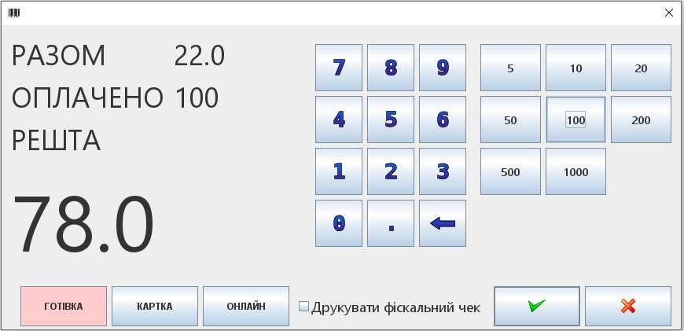

# POS-Terminal
The program is a workplace of a cashier in a store.

# Devices
* barcode scanner working in keyboard mode
* receipt printer with a ribbon width of 58 mm
* customer display <a href="https://posua.com/ru/displej-pokupatelya/22-lpos-vfd.html">LPOS-VFD</a> via FIRICH protocol
* fiscal registrar <a href="https://kasa.vchasno.com.ua/">Вчасно.Каса</a>
* Ingenico ict220 terminal with BPos-1 protocol
* ProsoPay coffee service
# Application created using
* Maven
* Java 17 LTS
* <a href="https://github.com/freemansoft/jacob-project">Jacob</a>
* NetBeans Swing GUI editor
* H2 Database
